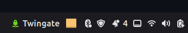
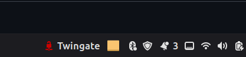
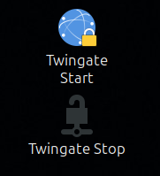

# Twingate Desktop Controls for Linux

Desktop shortcuts and a Cinnamon panel applet to start, stop, and monitor [Twingate](https://www.twingate.com/) on Linux.

  

## What's Included

### Cinnamon Panel Applet

A panel applet that shows the Twingate connection status at a glance:

| Online (Green) | Offline (Red) |
|:-:|:-:|
|  |  |

- **Green** = Online (connected through Twingate)
- **Red** = Offline (direct local network access)
- Click to open a menu with **Start** / **Stop** controls
- Auto-refreshes every 5 seconds

### Desktop Shortcuts

Two `.desktop` shortcuts for one-click start/stop:



- **Twingate Start** - Starts the Twingate service (prompts for password via `pkexec`)
- **Twingate Stop** - Stops the Twingate service

## Why?

When running Twingate in a Zero Trust home network setup, you may want to **toggle Twingate on/off depending on whether you're local or remote**:

- **Local (same LAN):** Stop Twingate to access resources directly with lower latency
- **Remote:** Start Twingate for secure, identity-verified access through your Zero Trust perimeter

This is especially useful when Twingate intercepts local network traffic and routes it through the cloud, even when you're sitting right next to your server.

## Prerequisites

- [Twingate Linux Client](https://www.twingate.com/docs/linux) installed
- Linux Mint / Cinnamon Desktop (for the applet)
- Any Linux with a freedesktop-compliant desktop (for the shortcuts)

## Installation

### Quick Install

```bash
./install.sh
```

### Manual Installation

**Desktop Shortcuts:**

```bash
cp desktop-shortcuts/*.desktop ~/Desktop/
chmod +x ~/Desktop/twingate-start.desktop ~/Desktop/twingate-stop.desktop
```

**Cinnamon Applet:**

```bash
cp -r cinnamon-applet/twingate-status@claudius ~/.local/share/cinnamon/applets/
```

Then right-click your Cinnamon panel → **Applets** → search for **Twingate Status** → **Add to panel**.

## Usage

### Panel Applet

| State | Icon | Color | Meaning |
|-------|------|-------|---------|
| Online | VPN icon | Green | Twingate is running, traffic routed through tunnel |
| Offline | Disconnected icon | Red | Twingate is stopped, direct network access |

Click the applet to toggle the menu, then select **Start Twingate** or **Stop Twingate**.

### Desktop Shortcuts

Double-click the shortcuts on your desktop. A password dialog (`pkexec`) will appear since starting/stopping the Twingate systemd service requires elevated privileges.

### Command Line

```bash
# Check status
twingate status

# Start/Stop
twingate start
twingate stop

# Service status
systemctl status twingate
```

## Background: Zero Trust Home Network

This project is part of a broader Zero Trust home network implementation based on [NIST SP 800-207](https://doi.org/10.6028/NIST.SP.800-207):

- **Twingate** as Software-Defined Perimeter (SDP)
- **Microsoft Entra ID** as Identity Provider (OIDC/SAML)
- **Conditional Access** with MFA
- **Microsoft Intune** for device compliance
- **Raspberry Pi** running Twingate Connector, Pi-hole, Home Assistant

All services on the Raspberry Pi are firewalled (`ufw`) and only accessible through authenticated Twingate connections or from enrolled, compliant devices.

## Project Structure

```
twingate-desktop-controls/
├── README.md
├── LICENSE
├── install.sh
├── desktop-shortcuts/
│   ├── twingate-start.desktop
│   └── twingate-stop.desktop
└── cinnamon-applet/
    └── twingate-status@claudius/
        ├── applet.js
        └── metadata.json
```

## Contributing

Contributions welcome! Some ideas:

- GNOME Shell extension version
- KDE Plasma widget
- XFCE panel plugin
- Notification on status change
- Split-tunneling toggle

## License

[MIT](LICENSE)
